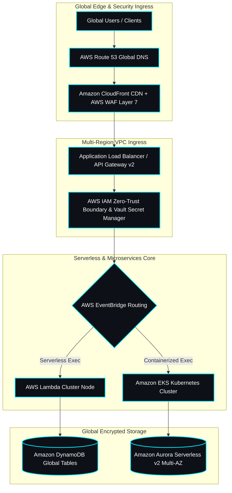

<div align="center">

  <!-- Custom SVG Typography Header -->
  

  <br />

  <!-- Dynamic Status & Telemetry Badges -->
  <a href="https://github.com/aakashpandian582006-ops">
    
  </a>
  <a href="https://github.com/aakashpandian582006-ops">
    
  </a>
  <a href="https://github.com/aakashpandian582006-ops">
    
  </a>
  <a href="https://github.com/aakashpandian582006-ops">
    
  </a>
  <a href="https://github.com/aakashpandian582006-ops">
    
  </a>

</div>

<br />

---

### ⚡ Live Infrastructure Status & Telemetry Terminal

```shell
[SYSTEM STATUS]: OPERATIONAL (99.999% SLA)
[PRIMARY REGION]: us-east-1 (AWS North Virginia) | [FAILOVER REGION]: eu-central-1 (AWS Frankfurt)
[COMPLIANCE]: SOC2 Type II | ISO 27001 | Zero-Trust Architecture Enabled
[IAC STACK]: Terraform v1.5+ | AWS CloudFormation | Docker | EKS Kubernetes
[ACTIVE SESSION]: Aakash Pandian -- Cloud Architect & System UI/UX Lead
```

<br />

---

### 🏛️ Enterprise Multi-Region Cloud Architecture Blueprint



<br />

---

### 🛠️ Technology Stack & Engineering Matrix

| Category | ☁️ Cloud Platforms & Infrastructure as Code (IaC) | 💻 Core Programming & Systems UI/UX |
| :--- | :--- | :--- |
| **Primary Cloud Infrastructure** | AWS (EKS, Lambda, S3, DynamoDB, VPC, Route 53, WAF, CloudWatch) | Python, TypeScript, Bash, Go |
| **Infrastructure as Code (IaC)** | Terraform v1.5+, AWS CloudFormation, Pulumi, IaC State Locking | System Topology Blueprinting, Enterprise Technical UI/UX |
| **Container & Service Mesh** | Docker, Kubernetes (EKS), Helm, ArgoCD, Microservices | Event-Driven Architecture, High-Availability Ingress |
| **DevSecOps & Compliance** | AWS IAM Zero-Trust Boundaries, HashiCorp Vault, SOC2 / ISO27001 | Telemetry Analytics Pipelines, CI/CD Pipeline Automation |

<br />

---

### 📦 Featured Flagship Production Deployments

<table>
  <tr>
    <td width="50%">
      <h4>1. AuraFinOps -- Autonomous Cloud FinOps & Cost Engine</h4>
      <p><b>Architectural Focus:</b> Multi-region AWS infrastructure optimization & automated asset management.</p>
      <p><b>Key Innovation:</b> Integrates Python-driven data pipelines with serverless automation logic to identify infrastructure waste, analyze CloudWatch metrics, and execute programmatic cost reductions.</p>
      <p><code>Python</code> <code>AWS</code> <code>CloudWatch</code> <code>IAM</code> <code>Serverless</code></p>
    </td>
    <td width="50%">
      <h4>2. helixflow-observability-platform -- Genomic Observability Platform</h4>
      <p><b>Architectural Focus:</b> Real-time telemetry analytics & deterministic simulation pipeline.</p>
      <p><b>Key Innovation:</b> High-throughput streaming engine designed for genomic workflow observability, incorporating live ENA sequencing metadata and AI-assisted operational intelligence.</p>
      <p><code>TypeScript</code> <code>Docker</code> <code>Terraform</code> <code>IaC Pipelines</code></p>
    </td>
  </tr>
  <tr>
    <td width="50%">
      <h4>3. url-intel-platform-or-cloud-analytics-dashboard -- Enterprise Traffic Intelligence</h4>
      <p><b>Architectural Focus:</b> Principal-level traffic analytics hub & proactive security compliance.</p>
      <p><b>Key Innovation:</b> Live telemetry ingestion engine engineered with high-availability routing, proactive WAF rule enforcement, and real-time network attack surface analysis.</p>
      <p><code>TypeScript</code> <code>AWS WAF</code> <code>Route 53</code> <code>API Gateway</code></p>
    </td>
    <td width="50%">
      <h4>4. serverless-messaging-platform -- Enterprise Communication Backend</h4>
      <p><b>Architectural Focus:</b> High-availability serverless messaging routing.</p>
      <p><b>Key Innovation:</b> Zero-idle-cost serverless contact platform engineered with AWS Lambda backends, dynamic CORS handling, and automated security boundaries.</p>
      <p><code>HTML</code> <code>TypeScript</code> <code>AWS Lambda</code> <code>Amazon S3</code></p>
    </td>
  </tr>
</table>

<br />

---

### 📊 Engineering Analytics & Github Metrics

<div align="center">
  
  
</div>

<br />

---

### 🐍 Live Contribution Activity Grid

<div align="center">
  <picture>
    <source media="(prefers-color-scheme: dark)" srcset="https://raw.githubusercontent.com/aakashpandian582006-ops/aakashpandian582006-ops/output/github-contribution-grid-snake-dark.svg">
    <source media="(prefers-color-scheme: light)" srcset="https://raw.githubusercontent.com/aakashpandian582006-ops/aakashpandian582006-ops/output/github-contribution-grid-snake.svg">
    
  </picture>
</div>

<br />

---

<div align="center">
  <p><b>Open for Global Enterprise Cloud Engineering, Systems Architecture & UI/UX Roles</b></p>
  <p>Get in touch: <a href="mailto:aakashpandian.5.8.2006@gmail.com">aakashpandian.5.8.2006@gmail.com</a></p>
</div>
