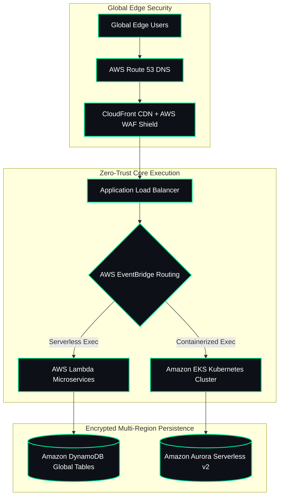

  

 

<!-- Dual-Column Bifold Hero Card -->
<table width="100%" style="border-collapse: collapse; border: 1px solid #00E599;">
  <tr>
    <td width="40%" align="center" style="background-color: #0d1117; padding: 15px; border-right: 1px solid #00E599; vertical-align: middle;">
      
    </td>
    <td width="60%" style="background-color: #0d1117; padding: 20px; vertical-align: top;">
      <h3 style="color: #00E599; font-family: 'Fira Code', monospace; margin-top: 0;">
        System.init(Enterprise_Cloud_Systems_Architect)
      </h3>
      

        <code>[STATUS]</code>: 🟢 OPERATIONAL (99.999% SLA) 
        <code>[LOCATION]</code>: Chennai, India (us-east-1 / ap-south-1) 
        <code>[ROLE]</code>: Cloud Architect & Systems UI/UX Lead 
        <code>[STACK]</code>: AWS Multi-Region | Terraform | EKS | Python | TS 
        <code>[SECURITY]</code>: SOC2 Type II | ISO 27001 | Zero-Trust Boundary
      

       
      

        
        
        
      

    </td>
  </tr>
</table>

 

 

> **I am an Enterprise Cloud Systems Architect and Computer Science & Engineering Specialist.**  
> I bridge high-level system UI/UX topology designs with production-ready cloud architectures. My focus is engineering resilient, zero-trust multi-region environments using Infrastructure as Code (IaC), serverless microservices, and automated telemetry.

 

<table width="100%">
  <tr>
    <td width="33%" align="center" style="padding: 10px; background-color: #0d1117; border: 1px solid #00E599;">
      ☁️ CLOUD TOPOLOGY & UI/UX
      <h4 style="color:#00E599; margin-top:10px;">Systems Visuals & Architecture</h4>
      
Translating complex cloud networking flows into clean, high-availability system topologies.

    </td>
    <td width="33%" align="center" style="padding: 10px; background-color: #0d1117; border: 1px solid #00E599;">
      🛡️ INFRASTRUCTURE & IAC
      <h4 style="color:#00E599; margin-top:10px;">Zero-Trust Security & AWS</h4>
      
Enforcing IAM permission boundaries, WAF edge rules, and encrypted S3/DynamoDB backends.

    </td>
    <td width="33%" align="center" style="padding: 10px; background-color: #0d1117; border: 1px solid #00E599;">
      ⚡ AUTOMATION & FINOPS
      <h4 style="color:#00E599; margin-top:10px;">Modular Terraform Pipelines</h4>
      
Provisioning scalable infrastructure with state locking and GitHub Actions CI/CD.

    </td>
  </tr>
</table>

 

---

 

 

---

 

  <!-- Cloud Infrastructure -->
  
  
  
  
  
  
  
  

 

---

 

<table width="100%" style="border-collapse: collapse; border: 1px solid #00E599;">
  <thead>
    <tr style="background-color: #00E599; color: #0d1117;">
      <th width="30%" align="left" style="padding: 10px;">Production Repository</th>
      <th width="45%" align="left" style="padding: 10px;">Innovation & Core Value</th>
      <th width="25%" align="left" style="padding: 10px;">Technical Stack</th>
    </tr>
  </thead>
  <tbody>
    <tr>
      <td style="padding: 12px; border-bottom: 1px solid #202b36; background-color: #0d1117;">
        <strong style="color:#00E599;">AuraFinOps</strong>
      </td>
      <td style="padding: 12px; border-bottom: 1px solid #202b36; background-color: #0d1117; color:#c0caf5;">
        Autonomous multi-region cloud cost optimization engine combining Python data pipelines and serverless automation logic.
      </td>
      <td style="padding: 12px; border-bottom: 1px solid #202b36; background-color: #0d1117;">
        <code>Python</code> <code>AWS</code> <code>CloudWatch</code> <code>IAM</code>
      </td>
    </tr>
    <tr>
      <td style="padding: 12px; border-bottom: 1px solid #202b36; background-color: #0d1117;">
        <strong style="color:#00E599;">helixflow-observability-platform</strong>
      </td>
      <td style="padding: 12px; border-bottom: 1px solid #202b36; background-color: #0d1117; color:#c0caf5;">
        Real-time genomic workflow observability platform integrating live sequence metadata with deterministic simulation logic.
      </td>
      <td style="padding: 12px; border-bottom: 1px solid #202b36; background-color: #0d1117;">
        <code>TypeScript</code> <code>Docker</code> <code>Terraform</code>
      </td>
    </tr>
    <tr>
      <td style="padding: 12px; border-bottom: 1px solid #202b36; background-color: #0d1117;">
        <strong style="color:#00E599;">url-intel-platform-or-cloud-analytics-dashboard</strong>
      </td>
      <td style="padding: 12px; border-bottom: 1px solid #202b36; background-color: #0d1117; color:#c0caf5;">
        Enterprise traffic analytics hub with live telemetry, high-availability routing, and proactive WAF compliance rules.
      </td>
      <td style="padding: 12px; border-bottom: 1px solid #202b36; background-color: #0d1117;">
        <code>TypeScript</code> <code>AWS WAF</code> <code>Route 53</code>
      </td>
    </tr>
    <tr>
      <td style="padding: 12px; background-color: #0d1117;">
        <strong style="color:#00E599;">serverless-messaging-platform</strong>
      </td>
      <td style="padding: 12px; background-color: #0d1117; color:#c0caf5;">
        Enterprise-grade serverless contact platform with zero-idle-cost AWS Lambda execution and dynamic CORS security.
      </td>
      <td style="padding: 12px; background-color: #0d1117;">
        <code>HTML</code> <code>TypeScript</code> <code>AWS Lambda</code>
      </td>
    </tr>
  </tbody>
</table>

 

---

 

  
  

 

---

### 🐍 Live Contribution Activity Grid

  <picture>
    <source media="(prefers-color-scheme: dark)" srcset="https://raw.githubusercontent.com/aakashpandian582006-ops/aakashpandian582006-ops/output/github-contribution-grid-snake-dark.svg">
    <source media="(prefers-color-scheme: light)" srcset="https://raw.githubusercontent.com/aakashpandian582006-ops/aakashpandian582006-ops/output/github-contribution-grid-snake.svg">
    
  </picture>

 

---

  
  

    Get in touch: <a href="mailto:aakashpandian.5.8.2006@gmail.com" style="color:#00E599;">aakashpandian.5.8.2006@gmail.com</a>
  

