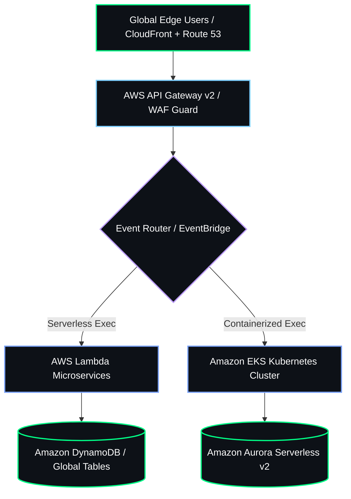

  
  <!-- Custom SVG Typography Header -->
  

   

  <!-- Dynamic Status & Telemetry Badges -->
  
  
  
  

 

---

### ⚡ Core Mission & Infrastructure Engineering

I am an **Enterprise Cloud Systems Architect** and **Computer Science & Engineering Specialist**. I bridge high-level system UI/UX topology designs with production-ready cloud architectures. My focus is engineering resilient, zero-trust multi-region environments using Infrastructure as Code (IaC), event-driven microservices, and automated telemetry.

 

<table width="100%">
  <tr>
    <td width="33%" align="center">
      <h3>☁️ CLOUD TOPOLOGY & UI/UX</h3>
      
Translating complex cloud networking flows into clean, high-availability system topologies.

    </td>
    <td width="33%" align="center">
      <h3>🛡️ INFRASTRUCTURE & IAC</h3>
      
Enforcing IAM permission boundaries, WAF edge rules, and encrypted S3/DynamoDB backends.

    </td>
    <td width="33%" align="center">
      <h3>⚡ AUTOMATION & FINOPS</h3>
      
Provisioning scalable infrastructure with state locking and GitHub Actions CI/CD.

    </td>
  </tr>
</table>

 

---

### 🏛️ 3D Interactive Topology Blueprint

 

---

### 🛠️ Engineering Matrix & Toolkits

| Category | Infrastructure Stack | Systems Visuals & Architecture |
| :--- | :--- | :--- |
| **Cloud Platforms & IaC** | AWS (EKS, Lambda, S3, DynamoDB, VPC), Terraform, CloudFormation | Topology Blueprinting, Multi-Region Failover Architecture |
| **Containers & Orchestration** | Docker, Kubernetes, Helm, ArgoCD | Zero-Downtime Rolling Deployments, Microservices Design |
| **CI/CD & Security** | GitHub Actions, AWS IAM Zero-Trust, WAF, Vault | Automated Security Scanning, IaC State Locking Pipelines |
| **Backend & Scripting** | Python, Bash, Node.js, Go | Event-Driven Microservices, Serverless Telemetry Pipelines |

 

---

### 📦 Featured Flagship Deployments

<table>
  <tr>
    <td width="33%">
      <h4>🌐 Sovereign Multi-Region Engine</h4>
      
Automated infrastructure provisioned via Terraform featuring cross-region failover and encrypted S3 state backends.

      
<code>Terraform</code> <code>AWS</code> <code>Lambda</code> <code>Route 53</code>

    </td>
    <td width="33%">
      <h4>⚡ Serverless Analytics Hub</h4>
      
High-throughput data ingestion engine using S3 + API Gateway + DynamoDB to eliminate idle server costs.

      
<code>AWS</code> <code>API Gateway</code> <code>DynamoDB</code> <code>Python</code>

    </td>
    <td width="33%">
      <h4>🛡️ FinOps Asset Tracker</h4>
      
Real-time cloud compliance tracking tool mitigating resource drift and optimizing cloud expenditure.

      
<code>Python</code> <code>AWS</code> <code>CloudWatch</code> <code>IAM</code>

    </td>
  </tr>
</table>

 

---

### 📊 System Telemetry & Contribution Metrics

  
  

 

---

### 🐍 Live Contribution Activity Grid

  <picture>
    <source media="(prefers-color-scheme: dark)" srcset="https://raw.githubusercontent.com/aakashpandian582006-ops/aakashpandian582006-ops/output/github-contribution-grid-snake-dark.svg">
    <source media="(prefers-color-scheme: light)" srcset="https://raw.githubusercontent.com/aakashpandian582006-ops/aakashpandian582006-ops/output/github-contribution-grid-snake.svg">
    
  </picture>

 

---

  
<b>Open for Cloud Systems Architecture & UI/UX Infrastructure Roles</b>

  
Get in touch: <a href="mailto:aakashpandian.5.8.2006@gmail.com">aakashpandian.5.8.2006@gmail.com</a>

