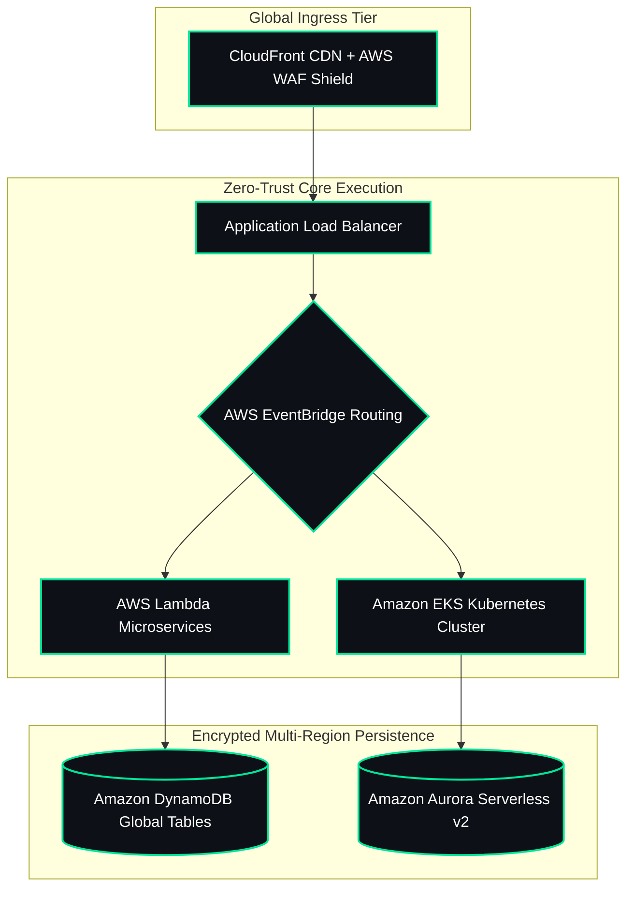
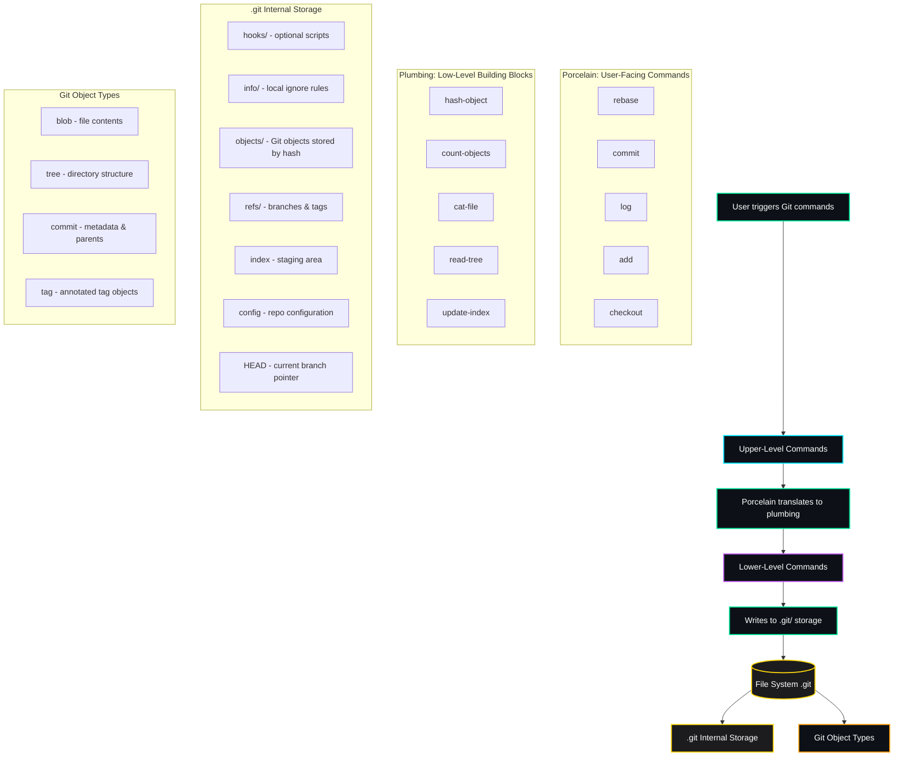

<!-- TOP HEADER BANNER -->

 

<!-- HERO BIFOLD SECTION -->
<table width="100%" style="border-collapse: collapse; border: 2px solid #00E599;">
  <tr>
    <td width="38%" align="center" valign="middle" style="background-color: #0d1117; padding: 15px; border-right: 2px solid #00E599;">
       
      
        
    </td>
    <td width="62%" valign="top" style="background-color: #0d1117; padding: 20px;">
       
      <pre><code>System.init(Enterprise_Cloud_Systems_Architect)
--------------------------------------------------
[STATUS]: 🟢 OPERATIONAL (99.999% SLA)
[ROLE]: Computer Science & Cloud Architect
[REGIONS]: us-east-1 (Primary) | eu-central-1 (Failover)
[CORE STACK]: AWS Multi-Region | Terraform | EKS | Python
[SECURITY]: Zero-Trust IAM Boundary | SOC2 / ISO27001</code></pre>
       
      

        
        
      

       
    </td>
  </tr>
</table>

 

---

## 🏛️ Enterprise Multi-Region Cloud Architecture

 

---

## 🧬 Git Internals & Data Storage Architecture

 

---

## 🛠️ Engineering Toolkits

  
  
  
  
  
  
  
  

 

---

## 📦 Featured Production Repositories

<table width="100%" style="border-collapse: collapse; border: 2px solid #00E599;">
  <thead>
    <tr style="background-color: #00E599; color: #0d1117;">
      <th width="30%" align="left" style="padding: 12px; font-size: 14px;">Production Repository</th>
      <th width="45%" align="left" style="padding: 12px; font-size: 14px;">Innovation & Core Value</th>
      <th width="25%" align="left" style="padding: 12px; font-size: 14px;">Technical Stack</th>
    </tr>
  </thead>
  <tbody>
    <tr>
      <td style="padding: 14px; border-bottom: 1px solid #202b36; background-color: #0d1117;">
        <strong style="color:#00E599; font-size:15px;">AuraFinOps</strong>
      </td>
      <td style="padding: 14px; border-bottom: 1px solid #202b36; background-color: #0d1117; color:#c0caf5;">
        Autonomous multi-region cloud cost optimization engine combining Python data pipelines and serverless logic.
      </td>
      <td style="padding: 14px; border-bottom: 1px solid #202b36; background-color: #0d1117;">
        <code>Python</code> <code>AWS</code> <code>CloudWatch</code>
      </td>
    </tr>
    <tr>
      <td style="padding: 14px; border-bottom: 1px solid #202b36; background-color: #0d1117;">
        <strong style="color:#00E599; font-size:15px;">helixflow-observability-platform</strong>
      </td>
      <td style="padding: 14px; border-bottom: 1px solid #202b36; background-color: #0d1117; color:#c0caf5;">
        Real-time genomic workflow observability platform integrating live sequence metadata with deterministic simulation.
      </td>
      <td style="padding: 14px; border-bottom: 1px solid #202b36; background-color: #0d1117;">
        <code>TypeScript</code> <code>Docker</code> <code>Terraform</code>
      </td>
    </tr>
    <tr>
      <td style="padding: 14px; border-bottom: 1px solid #202b36; background-color: #0d1117;">
        <strong style="color:#00E599; font-size:15px;">url-intel-platform-or-cloud-analytics-dashboard</strong>
      </td>
      <td style="padding: 14px; border-bottom: 1px solid #202b36; background-color: #0d1117; color:#c0caf5;">
        Enterprise traffic analytics hub with live telemetry, high-availability routing, and proactive WAF rules.
      </td>
      <td style="padding: 14px; border-bottom: 1px solid #202b36; background-color: #0d1117;">
        <code>TypeScript</code> <code>AWS WAF</code> <code>Route 53</code>
      </td>
    </tr>
    <tr>
      <td style="padding: 14px; background-color: #0d1117;">
        <strong style="color:#00E599; font-size:15px;">serverless-messaging-platform</strong>
      </td>
      <td style="padding: 14px; background-color: #0d1117; color:#c0caf5;">
        Enterprise-grade serverless contact platform with zero-idle-cost AWS Lambda execution.
      </td>
      <td style="padding: 14px; background-color: #0d1117;">
        <code>HTML</code> <code>TypeScript</code> <code>AWS Lambda</code>
      </td>
    </tr>
  </tbody>
</table>

 

---

## 📊 Telemetry & Activity

  
  

 

  <picture>
    <source media="(prefers-color-scheme: dark)" srcset="https://raw.githubusercontent.com/aakashpandian582006-ops/aakashpandian582006-ops/output/github-contribution-grid-snake-dark.svg">
    <source media="(prefers-color-scheme: light)" srcset="https://raw.githubusercontent.com/aakashpandian582006-ops/aakashpandian582006-ops/output/github-contribution-grid-snake.svg">
    
  </picture>

 

---

  

    🌐 Open for Global Enterprise Cloud Engineering, Systems Architecture & UI/UX Roles
  

  

    Get in touch: <a href="mailto:aakashpandian.5.8.2006@gmail.com" style="color:#00E599; font-weight: bold;">aakashpandian.5.8.2006@gmail.com</a>
  

