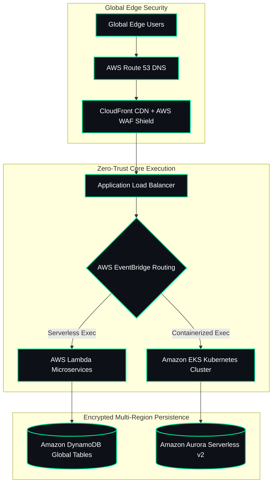

<div align="center">

  <!-- Custom Animated Typing SVG Header -->
  

  <br />

  <!-- Dynamic Telemetry & Status Badges -->
  <a href="https://github.com/aakashpandian582006-ops">
    
  </a>
  <a href="https://github.com/aakashpandian582006-ops">
    
  </a>
  <a href="https://github.com/aakashpandian582006-ops">
    
  </a>
  <a href="https://github.com/aakashpandian582006-ops">
    
  </a>
  <a href="https://github.com/aakashpandian582006-ops">
    
  </a>

</div>

<br />

<!-- Dual-Column Bifold Hero Card -->
<table width="100%" style="border-collapse: collapse; border: 2px solid #00E599;">
  <tr>
    <td width="42%" align="center" style="background-color: #0d1117; padding: 15px; border-right: 2px solid #00E599; vertical-align: middle;">
      
    </td>
    <td width="58%" style="background-color: #0d1117; padding: 20px; vertical-align: top;">
      <h3 style="color: #00E599; font-family: 'Fira Code', monospace; margin-top: 0;">
        System.init(Enterprise_Cloud_Systems_Architect)
      </h3>
      <p style="color: #c0caf5; font-size: 13.5px; line-height: 1.7; font-family: sans-serif;">
        <code>[STATUS]</code> : 🟢 <b>OPERATIONAL (99.999% SLA)</b><br />
        <code>[ACTIVE SESSION]</code> : <b>Aakash Pandian</b> -- Computer Science & Cloud Architect<br />
        <code>[PRIMARY REGION]</code> : <b>us-east-1</b> (AWS N. Virginia) | <code>[FAILOVER]</code> : <b>eu-central-1</b><br />
        <code>[CORE STACK]</code> : AWS Multi-Region | Terraform | EKS | Python | TypeScript<br />
        <code>[COMPLIANCE]</code> : SOC2 Type II | ISO 27001 | Zero-Trust Enabled
      </p>
      <br />
      <div align="left">
        <a href="https://github.com/aakashpandian582006-ops">
          
        </a>
        <a href="mailto:aakashpandian.5.8.2006@gmail.com">
          
        </a>
        <a href="https://github.com/aakashpandian582006-ops">
          
        </a>
      </div>
    </td>
  </tr>
</table>

<br />

---

## 👤 About Me & Core Infrastructure Mission

> **I am an Enterprise Cloud Systems Architect and Computer Science & Engineering Specialist.**  
> I bridge high-level system UI/UX topology designs with production-ready cloud architectures. My focus is engineering resilient, zero-trust multi-region environments using Infrastructure as Code (IaC), serverless microservices, and automated telemetry.

<br />

<table width="100%">
  <tr>
    <td width="33%" align="center" style="padding: 15px; background-color: #0d1117; border: 1px solid #00E599;">
      <span style="background-color:#00E599; color:#0d1117; padding:4px 10px; font-weight:bold; border-radius:4px;">☁️ CLOUD TOPOLOGY & UI/UX</span>
      <h4 style="color:#00E599; margin-top:12px;">Systems Visuals & Architecture</h4>
      <p style="color:#c0caf5; font-size:13px;">Translating complex cloud networking flows into clean, high-availability system topologies.</p>
    </td>
    <td width="33%" align="center" style="padding: 15px; background-color: #0d1117; border: 1px solid #00E599;">
      <span style="background-color:#00E599; color:#0d1117; padding:4px 10px; font-weight:bold; border-radius:4px;">🛡️ INFRASTRUCTURE & IAC</span>
      <h4 style="color:#00E599; margin-top:12px;">Zero-Trust Security & AWS</h4>
      <p style="color:#c0caf5; font-size:13px;">Enforcing IAM permission boundaries, WAF edge rules, and encrypted S3/DynamoDB backends.</p>
    </td>
    <td width="33%" align="center" style="padding: 15px; background-color: #0d1117; border: 1px solid #00E599;">
      <span style="background-color:#00E599; color:#0d1117; padding:4px 10px; font-weight:bold; border-radius:4px;">⚡ AUTOMATION & FINOPS</span>
      <h4 style="color:#00E599; margin-top:12px;">Modular Terraform Pipelines</h4>
      <p style="color:#c0caf5; font-size:13px;">Provisioning scalable infrastructure with state locking and GitHub Actions CI/CD.</p>
    </td>
  </tr>
</table>

<br />

---

## 🏛️ Enterprise Multi-Region Cloud Architecture Blueprint



<br />

---

## 🧬 Git Internals & Data Storage Architecture

```mermaid
flowchart TD
    classDef userLayer fill:#0d1117,stroke:#00E599,stroke-width:2px,color:#fff
    classDef porcelain fill:#0d1117,stroke:#00e5ff,stroke-width:2px,color:#fff
    classDef plumbing fill:#0d1117,stroke:#bf5af2,stroke-width:2px,color:#fff
    classDef storage fill:#1c1c1e,stroke:#ffd60a,stroke-width:2px,color:#fff
    classDef objects fill:#0d1117,stroke:#ff9f0a,stroke-width:2px,color:#fff

    U[User triggers Git commands] ::: userLayer --> UL[Upper-Level Commands] ::: porcelain
    
    subgraph Porcelain [Porcelain: User-Facing Commands]
        rebase(rebase)
        commit(commit)
        log(Log)
        add(+)
        checkout(checkout)
    end
    
    UL --> PTrans[Porcelain translates to plumbing] ::: userLayer
    PTrans --> LL[Lower-Level Commands] ::: plumbing
    
    subgraph Plumbing [Plumbing: Low-Level Building Blocks]
        hashObj[hash-object]
        countObj[count-objects]
        catFile[cat-file]
        readTree[read-tree]
        updateIndex[update-index]
    end
    
    LL --> Writes[Writes to .git/ storage] ::: userLayer
    Writes --> FS[(File System .git)] ::: storage
    
    FS --> GitInternal[.git Internal Storage] ::: storage
    FS --> GitObjects[Git Object Types] ::: objects
    
    subgraph InternalStorage [.git Internal Storage]
        hooks[hooks/ - optional scripts]
        info[info/ - local ignore rules]
        objects[objects/ - Git objects stored by hash]
        refs[refs/ - branches & tags]
        index[index - staging area]
        config[config - repo configuration]
        head[HEAD - current branch pointer]
    end
    
    subgraph ObjectTypes [Git Object Types]
        blob[blob - file contents]
        tree[tree - directory structure]
        commitObj[commit - metadata & parents]
        tag[tag - annotated tag objects]
    end
```

<br />

---

## 🛠️ Computational & Cloud Engineering Toolkits

<div align="center">

  <!-- Cloud Infrastructure -->
  
  
  
  
  
  
  
  

</div>

<br />

---

## 📦 Featured Production Repositories

<table width="100%" style="border-collapse: collapse; border: 2px solid #00E599;">
  <thead>
    <tr style="background-color: #00E599; color: #0d1117;">
      <th width="30%" align="left" style="padding: 12px; font-size: 14px;">Production Repository</th>
      <th width="45%" align="left" style="padding: 12px; font-size: 14px;">Innovation & Core Value</th>
      <th width="25%" align="left" style="padding: 12px; font-size: 14px;">Technical Stack</th>
    </tr>
  </thead>
  <tbody>
    <tr>
      <td style="padding: 14px; border-bottom: 1px solid #202b36; background-color: #0d1117;">
        <strong style="color:#00E599; font-size:15px;">AuraFinOps</strong>
      </td>
      <td style="padding: 14px; border-bottom: 1px solid #202b36; background-color: #0d1117; color:#c0caf5;">
        Autonomous multi-region cloud cost optimization engine combining Python data pipelines and serverless automation logic.
      </td>
      <td style="padding: 14px; border-bottom: 1px solid #202b36; background-color: #0d1117;">
        <code>Python</code> <code>AWS</code> <code>CloudWatch</code> <code>IAM</code>
      </td>
    </tr>
    <tr>
      <td style="padding: 14px; border-bottom: 1px solid #202b36; background-color: #0d1117;">
        <strong style="color:#00E599; font-size:15px;">helixflow-observability-platform</strong>
      </td>
      <td style="padding: 14px; border-bottom: 1px solid #202b36; background-color: #0d1117; color:#c0caf5;">
        Real-time genomic workflow observability platform integrating live sequence metadata with deterministic simulation logic.
      </td>
      <td style="padding: 14px; border-bottom: 1px solid #202b36; background-color: #0d1117;">
        <code>TypeScript</code> <code>Docker</code> <code>Terraform</code>
      </td>
    </tr>
    <tr>
      <td style="padding: 14px; border-bottom: 1px solid #202b36; background-color: #0d1117;">
        <strong style="color:#00E599; font-size:15px;">url-intel-platform-or-cloud-analytics-dashboard</strong>
      </td>
      <td style="padding: 14px; border-bottom: 1px solid #202b36; background-color: #0d1117; color:#c0caf5;">
        Enterprise traffic analytics hub with live telemetry, high-availability routing, and proactive WAF compliance rules.
      </td>
      <td style="padding: 14px; border-bottom: 1px solid #202b36; background-color: #0d1117;">
        <code>TypeScript</code> <code>AWS WAF</code> <code>Route 53</code>
      </td>
    </tr>
    <tr>
      <td style="padding: 14px; background-color: #0d1117;">
        <strong style="color:#00E599; font-size:15px;">serverless-messaging-platform</strong>
      </td>
      <td style="padding: 14px; background-color: #0d1117; color:#c0caf5;">
        Enterprise-grade serverless contact platform with zero-idle-cost AWS Lambda execution and dynamic CORS security.
      </td>
      <td style="padding: 14px; background-color: #0d1117;">
        <code>HTML</code> <code>TypeScript</code> <code>AWS Lambda</code>
      </td>
    </tr>
  </tbody>
</table>

<br />

---

## 📊 GitHub Telemetry & Contribution Matrix

<div align="center">
  
  
</div>

<br />

---

## 🐍 Live Contribution Activity Grid

<div align="center">
  <picture>
    <source media="(prefers-color-scheme: dark)" srcset="https://raw.githubusercontent.com/aakashpandian582006-ops/aakashpandian582006-ops/output/github-contribution-grid-snake-dark.svg">
    <source media="(prefers-color-scheme: light)" srcset="https://raw.githubusercontent.com/aakashpandian582006-ops/aakashpandian582006-ops/output/github-contribution-grid-snake.svg">
    
  </picture>
</div>

<br />

---

<div align="center">
  <p style="font-size: 16px; font-weight: bold; color: #00E599;">
    🌐 Open for Global Enterprise Cloud Engineering, Systems Architecture & UI/UX Roles
  </p>
  <p style="font-size: 14px;">
    Get in touch: <a href="mailto:aakashpandian.5.8.2006@gmail.com" style="color:#00E599; font-weight: bold;">aakashpandian.5.8.2006@gmail.com</a>
  </p>
</div>
